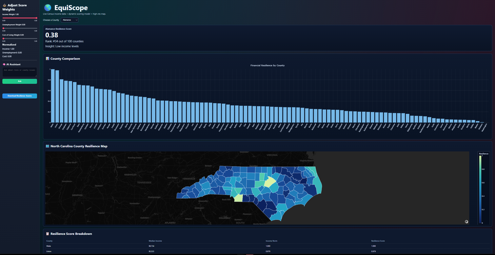

# Financial-Resilience


North Carolina County Resilience Dashboard.

Live site: https://tristansterling3-hub.github.io/Financial-Resilience-Dashboard/

A real-time dashboard using live U.S. Census income data and a high-resolution North Carolina county map.

## Overview

The NC County Resilience Dashboard visualizes financial resilience across all 100 North Carolina counties using live Census income data and an adjustable scoring model.

Users can:

- Adjust weighting for Income, Unemployment, and Cost of Living
- Compare counties using interactive charts
- Explore a high-resolution geographic map
- Receive rule-based insights regarding county risks and resource needs

This dashboard is intended for policy analysts, emergency planners, nonprofits, researchers, and others seeking a clear understanding of county-level financial resilience.

## Features

### Real-Time Resilience Scoring

The score incorporates:

- Median Income (via live Census API)
- Unemployment (placeholder for future upgrade)
- Cost of Living (placeholder for future upgrade)

### High-Resolution NC Map

The application uses a custom GeoJSON file providing:

- Detailed county borders
- Dynamic coloring based on resilience
- Interactive hover information

### Visual Tools

- Bar chart ranking counties by resilience
- Detailed breakdown table
- Insight summary for selected counties
- CSV export of resilience scores

### Sidebar AI Assistant

A rule-based assistant offering suggestions related to:

- Flood risk
- Hurricane preparation
- Low-income county support
- County-level resource planning

## How the Resilience Score Works

Each factor is normalized to a value between 0 and 1.

```text
Resilience Score =
   (Income Weight × Income_Norm)
 + (Unemployment Weight × (1 – Unemployment_Norm))
 + (Cost Weight × (1 – Cost_Norm))
```

Meaning:

- Higher income increases resilience
- Higher unemployment reduces resilience
- Higher cost of living reduces resilience

## Data Sources

### Income Data (Live)

- U.S. Census Bureau
- ACS 2022 5-Year Estimates
- Table B19013: Median Household Income

### Geographic Data

- High-resolution NC county boundary polygons (GeoJSON)

## Local Run

This is now a static HTML/CSS/JavaScript app (not Streamlit).

Run a local server from the repo root:

```powershell
python -m http.server 5500
```

Open `http://localhost:5500`.

## Deployment

Deploy with GitHub Pages:

1. Push repo to `main`
2. GitHub `Settings` -> `Pages`
3. Choose `Deploy from a branch`
4. Select `main` and `/ (root)`
5. Save and wait for publish

Live URL:

`https://tristansterling3-hub.github.io/Financial-Resilience-Dashboard/`

## Future Enhancements

- Integration of real unemployment and cost-of-living datasets
- AI assistant powered by a large language model
- County economic trend visualizations
- Disaster vulnerability indicators
- REST API for resilience scores
